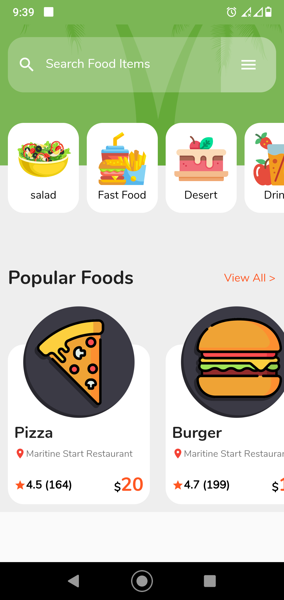
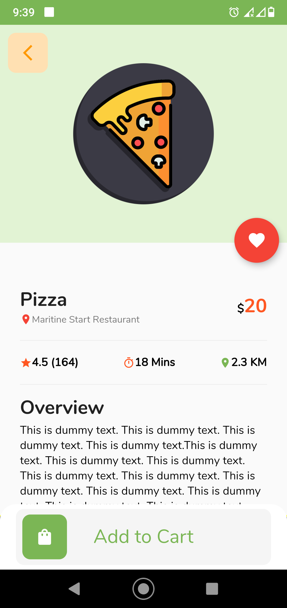

This is first page

This page is using Bounce Physics, so you can s scroll smoothly

This is second page in which you can see the details and add to cart with scroll horizontally the box beside "Add to Cart"

